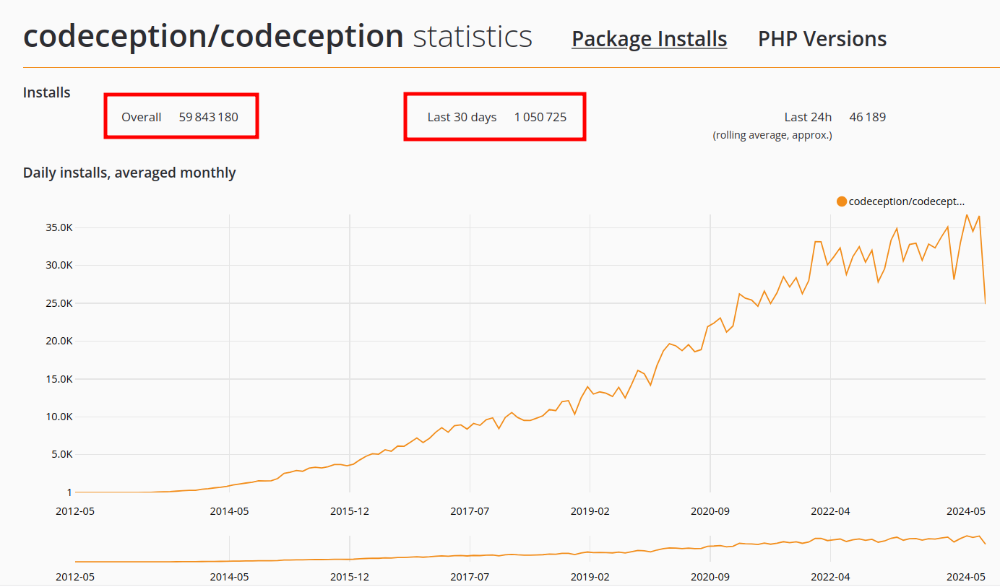
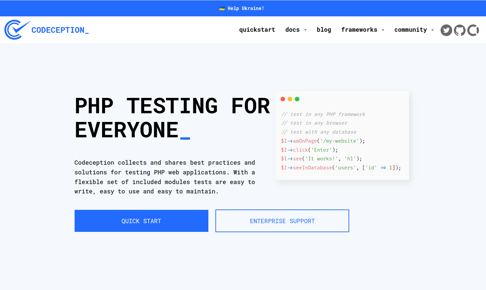
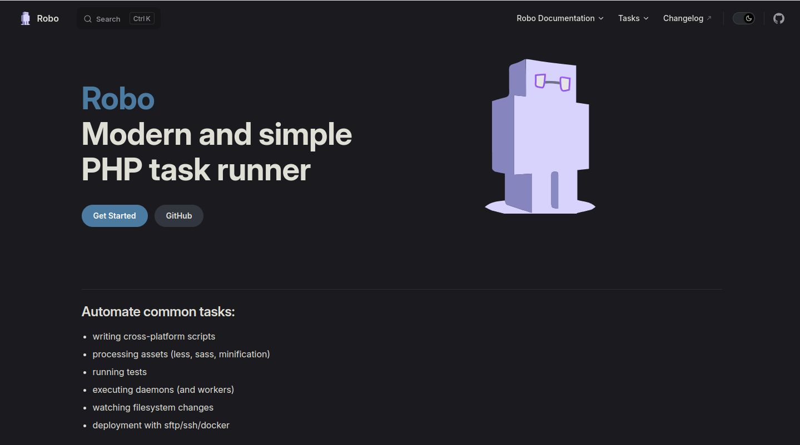
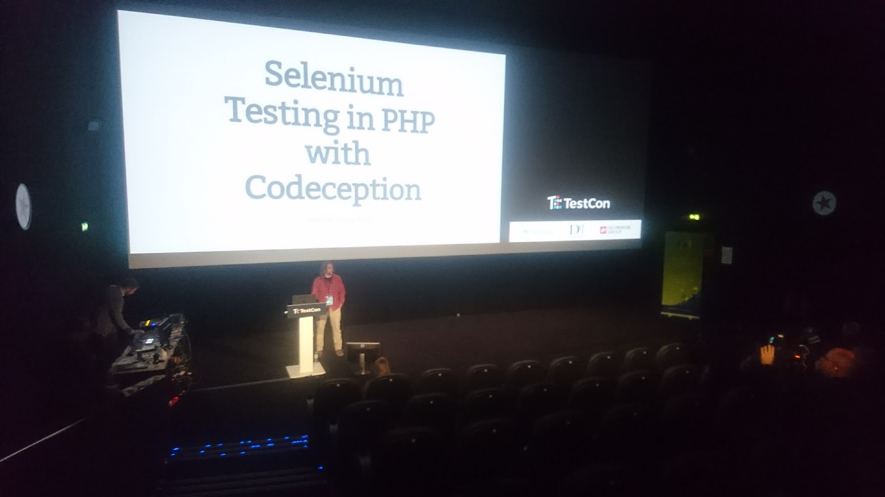
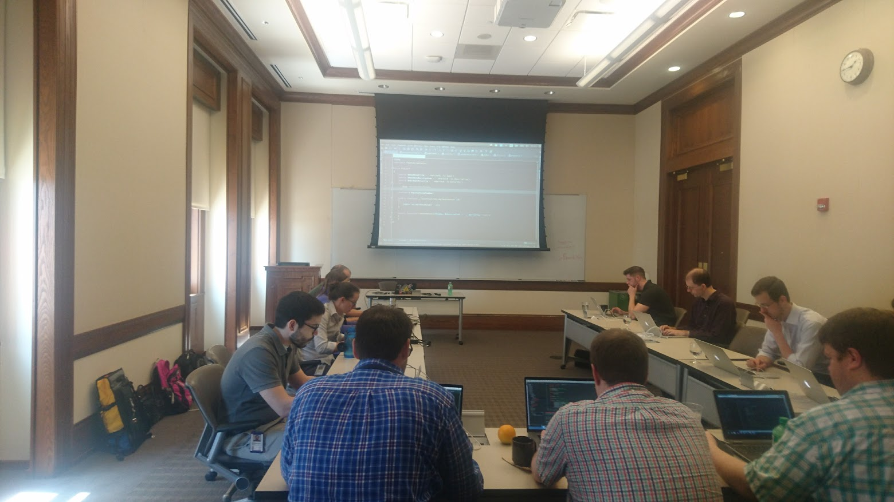
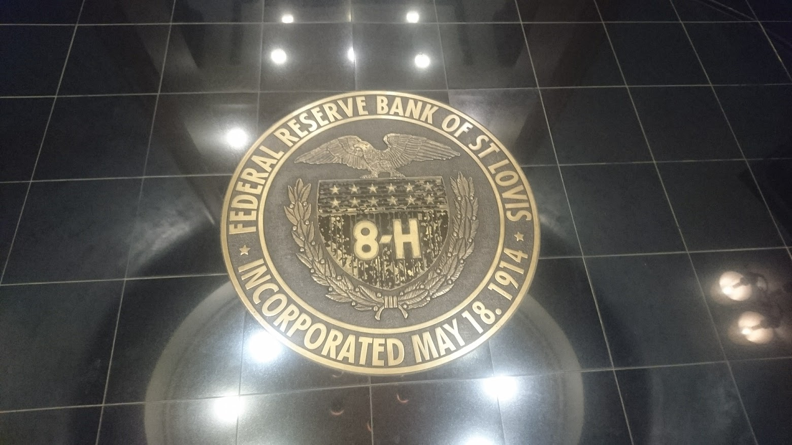
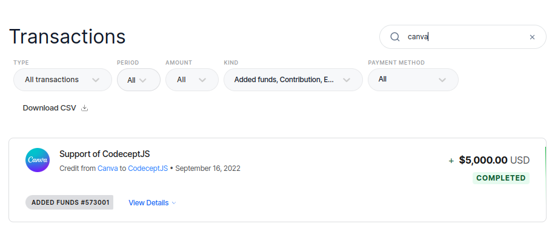

# Як написати опенсорс, що встановлять 100 млн разів

Михайло Боднарчук @davert

2024

---

---

---

## Codeception

* Full Stack Testing Framework
  * Інтеграція з Symfony, Laravel, ...
* Заснований в 2011 році
* Використовується для всіх видів тестів:
  * Unit
  * Functional
  * Acceptance
* Має модулі робити з WebDriver, MySQL, Redis, BDD, ...

---

---

---

## Robo

* Так раннер для PHP
  * Аналог Artisan, Symfony Console
* Один метод == одна команда
* Заміняв тонну скриптів для деплоя Codeception
* Зараз використовуається в Drupal спільноті

---

# Хто я

- PHP розробник, зараз більше Ruby / JS
- Автор опенсорс проектів:
  - Codeception (PHP)
  - Robo (PHP)
  - AspectMock (PHP)
  - CodeceptJS (JS)
- Зараз працюю над власним стартапом Testomat.io

---

# Як я попав в опенсорс?

> або як я спробував переконати команду писати тести, але для цього прийшлось створити власний тестовий фреймворк

---

## Щоб попасти в опенсорс треба:

- Вирішити свою задачу
- Масштабувати її для потреби аудиторії

--- 

# Нащо вам опенсорс?

* Найдешевший спосіб зробити щось корисне для людства
* Замість 100 сторінок резюме
* Щоб не писати код в стіл
* Якщо ви дійсно любите програмувати і створвати нові речі
* плюс в карму та в репутацію
* ~~донати!!!!~~ *(не сподівайтесь)*

---

# Як розвивати опенсорс-проект?

---

## Розповідати про нього

* Reddit reddit/r/php
* PHP Annotated Monthly
* Писати статті
* Відео
* Twitter (X)
* Opinion Leaders
* Конференції

---

## Бути готовим до токсичного фідбеку

* Нащо Х коли є Y
* Краще б ви...
* Та кому це треба?
* Фу, PHP!
* Де тести?
* Нічо не працює FATAL ERROR KERNEL PANIC AAAA!!!
* Що за фігню я тільки но встановив
* Ця фігня спортила мені 1 день і я опозорю її на весь інтернет

---

## Як з цим боротись?

* Максимально спростити установку та конфігурацію
* Мати общирну документацію (гайди та референс)
* Не сратись! *(так це складно)*
* Пробувати дружити з усіма
* Перетворювати критиків на контрибюторів
  
> 😇 Це ж опенсорс, хай зроблять краще!

---

# Опенсорс як процес

---

# Розбудовуйте проект

* Фіксіть баги, робіть фічі, слухайте фідбек
* Залучайте контрибьюторів
* Давайте їм права, створюйте команду
* Будьте відкритими до нових ідей
* Пишіть документацію
* Розповідайте про кожен реліз
* Пишіть більше туторіалів
* Створюйте спільноту: в Discord чи Slack.

---

> Опенсорс це бізнес, де не завжди очевидна монетизація

---

# Хрорший опенсорс помітно відразу

* Красиво оформлене Readme
  * Не забувайте про ✨🤩 та гіфки
* Наявність Issues / Pull Requests
* Нещодавні коміти
* Посилання на спільноту
* Список контрібьюторів
* Наявність спонсорів

---

# Які бонуси я отримав від опенсорсу?

---

###  Конференції

---

### Де я розказував про Codeception

|     |     |
|-----------------|------------------|
| США (Longhorn PHP, PHPTech)            | Нідерланди (DutchPHP)       |
| Бельгія (PHP Benelux)         | Литва (TestCon)            |
| Естонія (Nordic Testing Days)         | Польша (PHPEU)           |
| Шотландія (Scotland PHP)       | Німеччина        |
| Іспанія (Joomla Days)        | Австрія          |
| Франція (PHP Tour)         | Болгарія (Bulgaria PHP)         |
| Сербія (PHP Serbia)          | Турція (Istanbul PHP)           |

---

## Консультації та Тренінги

---

---

## Донати!!!

---

## Комьюніті для запуску власної справи

* Не монетизуйте напряму
* Створіть суміжний комерційний продукт
* Використовуйте спільноту для первинного промо продукту
* Так з'явився [Testomat.io](https://testomat.io)

---

## Чи OpenSource це на все життя?

* В якийсь момент ви захочете передати його комусь
* Знайдіть цю людину в команді
* Не всі готові проходити шлях від початку до кінця
* До речі, **Codeception потребує мейнтенерів**!

---

## Долучайтесь до команди Codeception якщо хочете зробити щось класне в PHP!

* підтримка модулів фреймворків
* розвиток нових фіч
* ....
* 🚀🔬🤩✨

---

## Дякую!

Михайло Боднарчук

* Twitter, Telegram: **@davert**
* GitHub: **@davertmik**
* https://testomat.io - Next-Gen Test Management SaaS
* https://codeception.com - Full Stack Testing
* https://robo.li - PHP Task Runner

